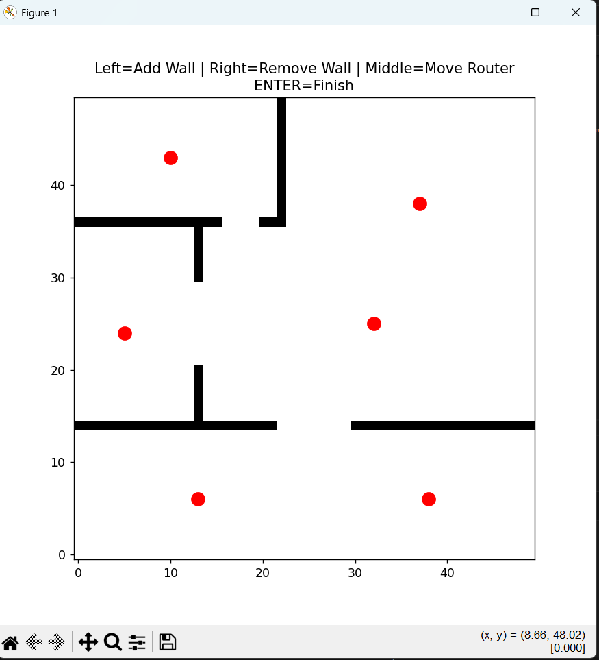
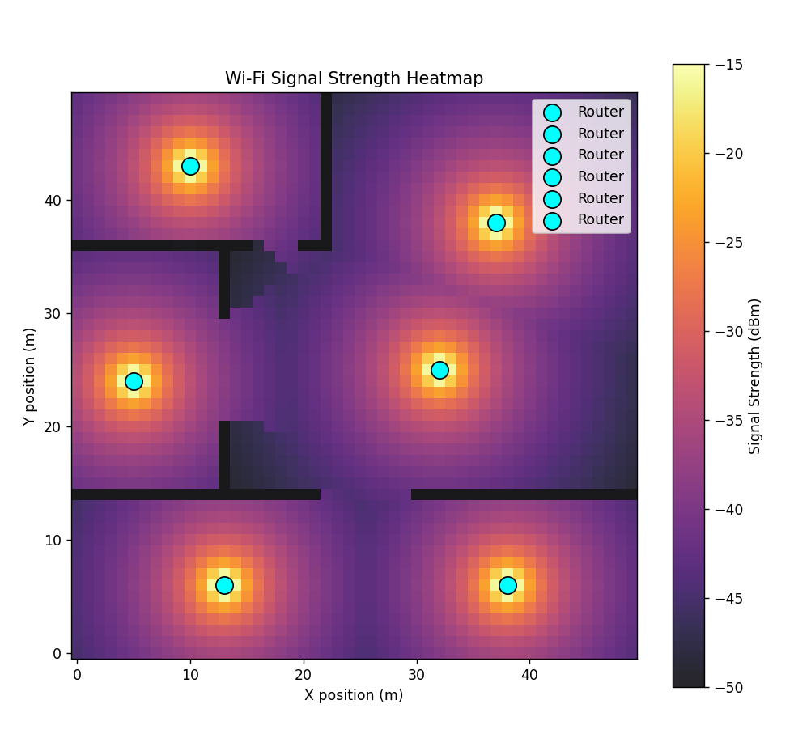
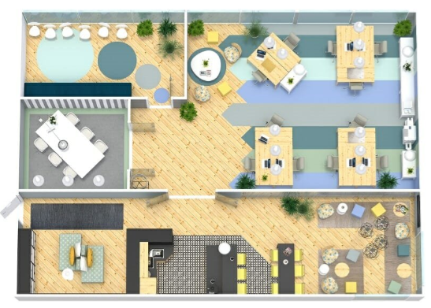
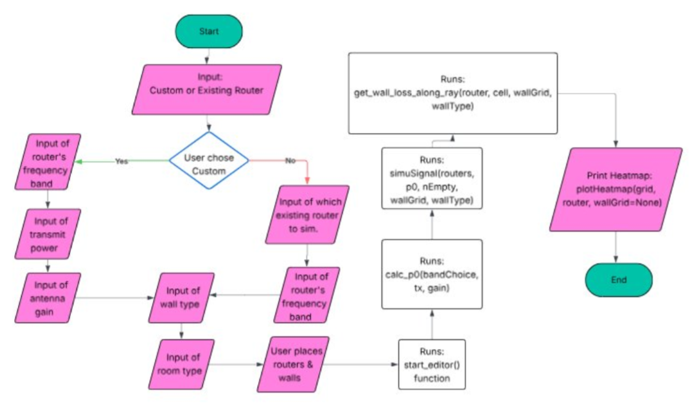

# Wi-Fi Coverage Simulation

Python desktop tool that models indoor Wi-Fi propagation in **dBm** on a user-drawn floor plan. Compare router placement, band choice, and building materials before deployment.

## Overview

Configure real or custom router specs, sketch walls, place access points, and view a **dBm heatmap** on that layout. Multi-AP setups use a best-server model (strongest signal per cell). Course project with full write-up in [`WiFi Attenuation Sim Report.pdf`](WiFi%20Attenuation%20Sim%20Report.pdf).

## How to use

```bash
pip install numpy matplotlib
python wifiSim.py
```

Terminal: `custom` or `best` → band → wall type → clutter. Editor: **left-click** walls, **right-click** erase, **middle-click** move router; add/remove APs; **Enter** to run.

## Screenshots

| Floor plan editor | Signal heatmap (dBm) |
| :---: | :---: |
|  |  |





## Technical highlights

| Area | Implementation |
|------|----------------|
| Reference power | Friis at 1 m: P₀ = Pₜ + Gₜ − 20·log₁₀(f) − 147.55 |
| Path loss | Log-distance with clutter exponent n = 1.6 / 2.5 / 3.5 |
| Walls | Ray sampling; drywall 5 · brick 12 · concrete 20 (dB per step) |
| Multi-AP | Per-cell maximum across routers |
| Stack | NumPy + Matplotlib |

| File | Role |
|------|------|
| `wifiSim.py` | CLI → editor → simulate → plot |
| `gui.py` | 50×50 floor editor |
| `simFuncs.py` | `calc_p0`, ray wall loss, `simuSignal` |
| `inAndOut.py` | Router presets, I/O, heatmap |

## Requirements

Python 3, `numpy`, `matplotlib`. Keep all `.py` files beside `wifiSim.py`. **Push the `img/` folder** with the repo so GitHub can load the images above.
